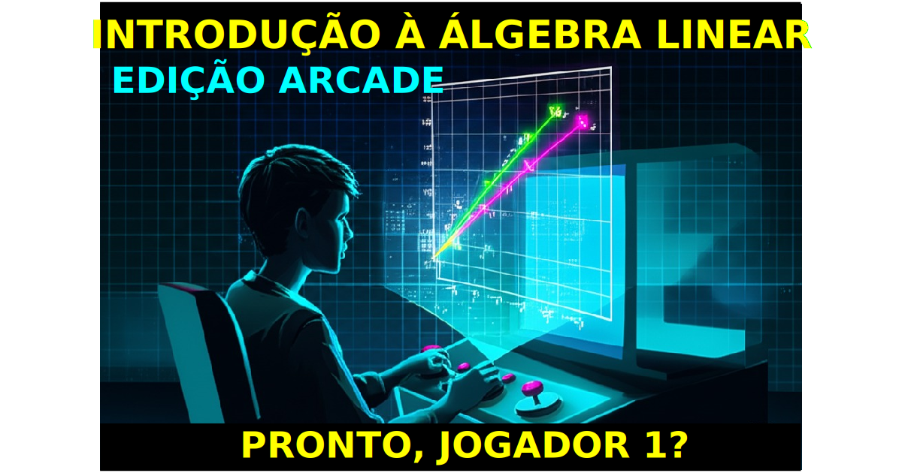

Bem-vindo ao repositório do curso de Introdução à Álgebra Linear! Este curso foi desenvolvido para fornecer aos alunos uma base sólida nos conceitos fundamentais da álgebra linear.

# [Notas 2025-1](notas/2025.md)
Vista da PS dia 15/07 a partir das 13:00h até às 15h, ou dia 17/07 das 10:40 até 12h.

## Sobre o Curso

Este curso aborda os princípios básicos da álgebra linear, uma área fundamental da matemática com aplicações em diversas disciplinas, incluindo física, engenharia, economia e ciência da computação.

  
Como não passar nesta matéria

_________
  # Como não passar nesta matéria

  Olá, queridos alunos! Vamos falar sobre como ter sucesso neste curso? Não? Ah, você quer saber como não passar?
  Aqui vai um guia infalível para garantir que você não passe nesta matéria. Siga estas dicas e o insucesso será seu fiel companheiro!

  ## 1. Estude só na véspera da prova - o segredo do fracasso!

  Lembre-se: a universidade é igualzinha ao ensino médio! Aquelas matérias complexas e extensas? Pfff, besteira! Você consegue absorver todo esse conteúdo em uma única noite de estudos intensos. Afinal, quem precisa de tempo para processar informações, não é mesmo?

  Ignore completamente o fato de que o cérebro precisa de tempo para consolidar memórias e criar conexões entre conceitos. A neurociência? Ora, isso é só um modismo passageiro!

  ## 2. Sono é para os fracos!

  Dormir é perda de tempo. Quem precisa de sono quando se tem café e energéticos? Esqueça tudo o que ouviu sobre a importância do sono para a consolidação da memória e para o bom funcionamento cognitivo. 

  Afinal, o que os neurocientistas sabem? Eles só estudam o cérebro há décadas. Você, com sua sagacidade de última hora, certamente sabe mais do que eles.

  ## 3. Consistência? Que bobagem!

  Estudar um pouquinho todos os dias? Que ideia mais absurda! É muito melhor acumular todo o conteúdo para uma maratona de estudos na véspera da prova. Seu cérebro vai adorar essa sobrecarga de informações de última hora.

  Ignore completamente as pesquisas que mostram que o aprendizado espaçado é mais eficaz. Afinal, o que é a ciência cognitiva comparada à sua intuição infalível?

  ## Conclusão

  Seguindo essas dicas, você estará no caminho certo para não passar nesta matéria. Mas hey, se por algum motivo você decidir fazer o oposto do que foi sugerido aqui - estudar consistentemente, dormir bem e respeitar os processos de aprendizagem do seu cérebro - bem, aí a responsabilidade é toda sua se acabar passando com louvor!
_________

  
Livro Adotado

_________
O curso é baseado no livro:

**"Álgebra Linear com Aplicações"** de Howard Anton

- 📢 Atenção, alunos! 📢
- 📖 LEITURA OBRIGATÓRIA do livro texto! 🔍
- 🎓 Em aula, abordaremos os temas mais complexos.
- 🏠 Outros tópicos importantes são para estudo individual no livro.
_________

## Ementa Detalhada do Curso

### CAPÍTULO 1: Códigos da Realidade: Sistemas e Matrizes [🎧](https://oangelo.github.io/Introducao-a-Algebra-Linear/audio/matrizes_sistemas_bill.mp3)

- [Introdução aos sistemas de equações lineares](https://oangelo.github.io/Introducao-a-Algebra-Linear/exercicios/capitulo-1/sistemas-lineares.html)
- [Eliminação Gaussiana: o primeiro "hack"](https://oangelo.github.io/Introducao-a-Algebra-Linear/exercicios/capitulo-1/eliminacao-gaussiana.html) [👨‍🏫](https://oangelo.github.io/Introducao-a-Algebra-Linear/slide-decks/eliminacao_gaussiana.html)
- [Matrizes e propriedades das operações matriciais](https://oangelo.github.io/Introducao-a-Algebra-Linear/exercicios/capitulo-1/propriedades-matriciais.html) [👨‍🏫](https://oangelo.github.io/Introducao-a-Algebra-Linear/slide-decks/propriedades.html)
- [Matrizes Inversas: "desfazer operações"](https://oangelo.github.io/Introducao-a-Algebra-Linear/exercicios/capitulo-1/matrizes-inversas.html) [👨‍🏫](https://oangelo.github.io/Introducao-a-Algebra-Linear/slide-decks/inversas.html)
- [Quiz do Capítulo](quiz/matrizes_e_sitemas.md)

🔍 Glossário de Termos-Chave

* **Sistema Linear:** Conjunto de equações lineares com as mesmas variáveis.
* **Matriz:** "Grid de Dados" - Tabela retangular de elementos dispostos em linhas e colunas.
* **Vetor:** Matriz com apenas uma linha ou uma coluna.
* **Matriz Aumentada:** Matriz que representa um sistema linear, contendo os coeficientes das variáveis e os termos independentes.
* **Operações Elementares com Linhas:** "Hacks básicos" - Operações que podem ser aplicadas para transformar uma matriz sem alterar a solução.
* **Forma Escalonada:** Estado da matriz após simplificação parcial.
* **Forma Escalonada Reduzida:** O estado mais simplificado de uma matriz.
* **Matriz Inversa:** "Ctrl+Z da matriz" - Matriz que desfaz a operação da matriz original.

### CAPÍTULO 2: A Assinatura Digital: Determinantes [👨‍🏫](https://oangelo.github.io/Introducao-a-Algebra-Linear/slide-decks/determinante.html) [📝](quiz/determinantes.md) [🎧](https://oangelo.github.io/Introducao-a-Algebra-Linear/audio/determinants_bill.mp3)

- [Expansão em Cofatores: "decodificação recursiva"](https://oangelo.github.io/Introducao-a-Algebra-Linear/exercicios/capitulo-2/determinantes-cofatores.html)
- [Redução por Linhas: "simplificação de código"](https://oangelo.github.io/Introducao-a-Algebra-Linear/exercicios/capitulo-2/determinantes-reducao.html)
- [Propriedades dos Determinantes: "padrões invioláveis"](https://oangelo.github.io/Introducao-a-Algebra-Linear/exercicios/capitulo-2/propriedades-determinantes.html)
- [Regra de Cramer: a "chave mestra"](https://oangelo.github.io/Introducao-a-Algebra-Linear/exercicios/capitulo-2/regra-cramer.html)

🔍 Glossário de Termos-Chave

* **Determinante:** "Assinatura digital" - Função que associa um número real a uma matriz quadrada.
* **Menor:** Determinante da submatriz obtida ao remover uma linha e uma coluna.
* **Cofator:** Produto do menor pelo fator (-1)^(i+j).
* **Matriz de cofatores:** Matriz onde cada elemento é o cofator correspondente da matriz original.
* **Adjunta:** Matriz transposta da matriz de cofatores.
* **Regra de Cramer:** "Chave mestra" - Fórmula que utiliza determinantes para solucionar sistemas.

### [CAPÍTULO 3: Espaços Vetoriais Euclidianos](https://oangelo.github.io/Introducao-a-Algebra-Linear/slide-decks/espacos-vetoriais-euclidianos.html)

Glossário de Termos Chave

_________
### Glossário de Termos Chave

* **Vetor geométrico:** Um segmento de reta orientado, caracterizado por seu comprimento, direção e sentido.
* **Direção e sentido:** A direção de um vetor é dada pela reta que o contém, e o sentido é determinado pela orientação da seta.
* **Comprimento (ou magnitude):** A medida do vetor, representando a distância entre seu ponto inicial e final.
* **Ponto inicial:** O ponto de onde o vetor se origina.
* **Ponto final:** O ponto onde o vetor termina.
* **Vetores equivalentes:** Vetores com o mesmo comprimento, direção e sentido, independentemente de sua posição no espaço.
* **Vetor zero:** O vetor com comprimento zero, sem direção ou sentido definido.
* **Adição vetorial, regra do paralelogramo e regra do triângulo:** Métodos geométricos para somar vetores.
* **Subtração vetorial:** A operação de encontrar a diferença entre dois vetores.
* **Negativo de um vetor:** O vetor com o mesmo comprimento e direção, mas sentido oposto ao vetor original.
* **Multiplicação por escalar:** A operação de multiplicar um vetor por um número real (escalar), alterando seu comprimento e/ou sentido.
* **Vetores colineares:** Vetores que possuem a mesma direção, podendo ter o mesmo sentido ou sentidos opostos (também chamados de vetores paralelos).
* **Componentes de um vetor:** As coordenadas do ponto final do vetor quando seu ponto inicial está na origem de um sistema de coordenadas.
* **Coordenadas de um ponto:** Um conjunto de números que identificam a posição de um ponto em um sistema de coordenadas.
* **Ênupla:** Uma sequência ordenada de números reais, utilizada para representar pontos ou vetores em espaços de dimensão n.
* **Espaço de dimensão n (Rn):** O conjunto de todas as ênuplas ordenadas com n componentes.
* **Operações vetoriais no espaço de dimensão n:** Adição, subtração e multiplicação por escalar, realizadas componente a componente.
_________

- Vetores bi, tri e n–dimensionais
- Norma, produto escalar e distância em $R^n$
- Ortogonalidade
- A geometria de sistemas lineares
- Produto vetorial
- [Quiz](quiz/ga.md)

Aproveito para compartilhar a [solução](https://oangelo.github.io/Introducao-a-Algebra-Linear/exercicios/sistemas.html) do problema de uma prova

### [CAPÍTULO 4: TRANSFORMAÇÕES EM ESPAÇOS VETORIAIS EUCLIDIANOS](https://oangelo.github.io/Introducao-a-Algebra-Linear/slide-decks/transformacoes.html)
- Espaço Euclidiano n-dimensional
- Transformações Lineares de $R^n$ em $R^m$
- Propriedades das Transformações Lineares de $R^n$ em $R^m$

### [CAPÍTULO 5: Espaços Vetoriais Arbitrários](https://oangelo.github.io/Introducao-a-Algebra-Linear/slide-decks/espacos.html)

Glossário de Termos-Chave

_________
### Glossário de Termos-Chave

#### Axiomas de Espaço Vetorial

1. **Fechamento sob Adição:** Se $u$ e $v$ pertencem a $V$, então $u + v$ também pertence a $V$.
2. **Comutatividade da Adição:** $u + v = v + u$
3. **Associatividade da Adição:** $(u + v) + w = u + (v + w)$
4. **Existência do Vetor Nulo:** Existe um vetor $0$ em $V$ tal que $0 + u = u$ para todo $u$ em $V$.
5. **Existência do Inverso Aditivo:** Para cada $u$ em $V$, existe um vetor $-u$ em $V$ tal que $u + (-u) = 0$.
6. **Fechamento sob Multiplicação por Escalar:** Se $a$ é um escalar e $u$ pertence a $V$, então $au$ também pertence a $V$.
7. **Distributividade da Multiplicação por Escalar em relação à Adição de Vetores:** $a(u + v) = au + av$
8. **Distributividade da Multiplicação por Escalar em relação à Adição de Escalares:** $(a + b)u = au + bu$
9. **Associatividade da Multiplicação por Escalar:** $a(bu) = (ab)u$
10. **Identidade da Multiplicação por Escalar:** $1u = u$

#### Outros Termos

* **$\mathbb{R}^n$:** O espaço vetorial de todas as n-tuplas de números reais.
* **Sequência Infinita:** Uma lista ordenada de números reais que continua indefinidamente.
* **Vetor Nulo (ou Vetor Zero):** O vetor em um espaço vetorial que, quando adicionado a qualquer outro vetor, não o altera.
* **Linearmente Independente:** Um conjunto de vetores em que nenhum vetor pode ser escrito como uma combinação linear dos outros vetores do conjunto.
* **Linearmente Dependente:** Um conjunto de vetores em que pelo menos um vetor pode ser escrito como uma combinação linear dos outros vetores do conjunto.
* **Wronskiano:** Um determinante usado para determinar a independência linear de um conjunto de funções.
* **Coordenadas de um Vetor:** Os escalares que multiplicam os vetores de base na representação única de um vetor como combinação linear dos vetores de base.
* **Vetor de Coordenadas:** O vetor formado pelas coordenadas de um vetor em relação a uma base específica.
* **Dimensão Finita:** Um espaço vetorial que possui uma base finita.
* **Dimensão Infinita:** Um espaço vetorial que não possui uma base finita.
* **Operador Linear (ou Transformação Linear):** Uma função $T: V \to W$ entre espaços vetoriais que preserva as operações de adição e multiplicação por escalar:
  * $T(u + v) = T(u) + T(v)$
  * $T(au) = aT(u)$
* **Nulidade:** A dimensão do núcleo de uma transformação linear.
* **Posto:** A dimensão da imagem de uma transformação linear.
_________

- Espaços vetoriais reais
- Subespaços
- Independência linear
- Coordenadas e bases
- Dimensão
- Mudança de bases
- Espaço linha, espaço coluna e espaço nulo
- Posto, nulidade e os espaços matriciais fundamentais
- Transformações matriciais de $R^n$ em $R^m$
- Propriedades das transformações matriciais
- A geometria de operadores matriciais de $R^2$
- [Quiz](quiz/espaco_linear.md)

### CAPÍTULO 7: Autovalores e Autovetores

Glossário de Termos Chave

_________
### Glossário de Termos Chave

* **Autovalor ($\lambda$):** Um escalar que, quando multiplicado por um autovetor, resulta em um múltiplo escalar desse autovetor.

* **Autovetor ($\mathbf{x}$):** Um vetor não nulo que, ao ser multiplicado por uma matriz, resulta em um múltiplo escalar de si mesmo.
 * $A\mathbf{x} = \lambda\mathbf{x}$, onde $A$ é uma matriz, $\lambda$ é o autovalor e $\mathbf{x}$ é o autovetor.

* **Equação Característica:** Uma equação polinomial obtida a partir do determinante $\det(\lambda I - A) = 0$, cujas raízes são os autovalores da matriz $A$.

* **Polinômio Característico:** O polinômio obtido ao calcular o determinante $\det(\lambda I - A)$.

* **Autoespaço:** O conjunto de todos os autovetores associados a um determinado autovalor, juntamente com o vetor nulo.
 * $E_\lambda = \{\mathbf{x} \in \mathbb{R}^n : A\mathbf{x} = \lambda\mathbf{x}\}$

* **Matriz Diagonalizável:** Uma matriz que pode ser escrita na forma $P^{-1}AP = D$, onde $P$ é uma matriz invertível e $D$ é uma matriz diagonal.

* **Matriz Diagonal:** Uma matriz quadrada em que todos os elementos fora da diagonal principal são zero.
 * $D = \begin{bmatrix} \lambda_1 & 0 & \cdots & 0 \\ 0 & \lambda_2 & \cdots & 0 \\ \vdots & \vdots & \ddots & \vdots \\ 0 & 0 & \cdots & \lambda_n \end{bmatrix}$

* **Multiplicidade Algébrica:** O número de vezes que um autovalor aparece como raiz da equação característica.

* **Multiplicidade Geométrica:** A dimensão do autoespaço associado a um autovalor.
 * $\dim(E_\lambda)$

* **Autovalores Complexos:** Autovalores que são números complexos ($a + bi$), ocorrendo quando a equação característica possui raízes complexas.

* **Sistema de Equações Diferenciais Lineares:** Um sistema de equações que envolvem as derivadas de várias funções desconhecidas.
 * $\frac{d\mathbf{x}}{dt} = A\mathbf{x}$, onde $A$ é uma matriz constante.

_________

- Autovalores e autovetores
- Diagonalização
- [Quiz](quiz/auto_valores_vetores.md)

  
Calendário de Provas

  <ul>
    <li>P1: </li>
    <li>PF: </li>
  </ul>
  

  
Gabaritos

 - [PS - 2024 - Gabarito](https://oangelo.github.io/Introducao-a-Algebra-Linear/Provas/2024/PS.html)
 - [P2 - 2024 - Gabarito](https://oangelo.github.io/Introducao-a-Algebra-Linear/Provas/2024/p2.html)

[Roleta](https://oangelo.github.io/Introducao-a-Algebra-Linear/roleta.html)

📝 Bons estudos e boa sorte! 🍀📐🔢
